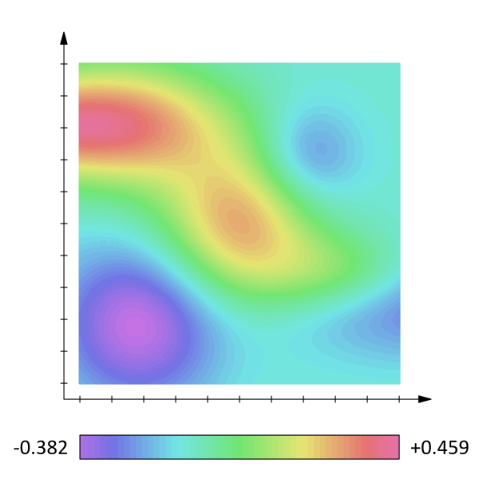
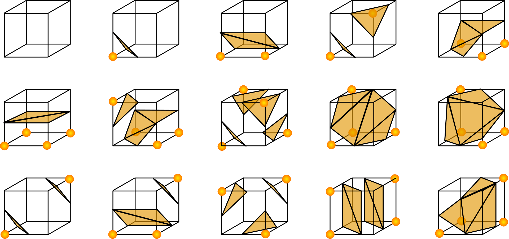

# MARCHING CUBES

I implmented marching cubes in C with opengl and glfw. But what is marching cubes ?

## What is it ?

Marching cubes is an algorithm that turns a scalar field into a mesh so that it can be drawn.

The algrithm works as following, first chope up the region you need to mesh in to little cubes. At each of the corners of a cube compute the value of the scalar field. Then if the value of a corner is less than the floor level given, `iso_level` in the code, it is rock otherwise it is air, in between air and rock is where we want to draw the mesh. Here is the lazy part, you bascially have giant lookup tables to fetch all the mesh vertices and triangles for this cube. Since there are 256 different cube configurations that is feasable but maybe marchinghypercube in 10D or more might take Exabytes of storage ([1024!](1024!.md)). Theses tables can be found either in my code or [there](https://paulbourke.net/geometry/polygonise/).

But someone, smarter than me might be able to use the fact that there are 15 unique cases.

Then the fancy part: do it for all cubes and you done, well if you used the correct `cube_size`.

## who care of marching cubes ?

Well in the first place the marching cubes algrithm was invented by William E. Lorensen and Harvey E. Cline with the purpose of visualizing the results of medical scans. So it is not useless, but in fact it way more usefull than this, it can be use to create terrain out of 3D noise, more info [there](https://en.wikipedia.org/wiki/Marching_cubes)
